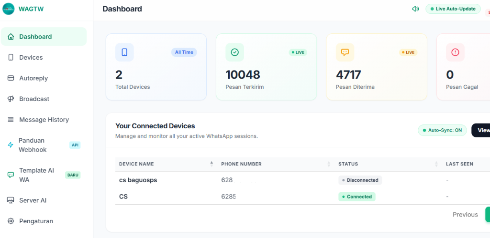

# 🚀 WAGTW - WhatsApp Multi-Device Gateway & AI Marketing Platform


-purple?style=flat-square)


<p align="center">
  
</p>

**WAGTW** adalah platform WhatsApp Gateway modern berbasis **PHP MVC (Native)** dan **Node.js Baileys Engine v7 (WebSocket murni tanpa Chromium/Puppeteer)**. Sistem ini sangat hemat RAM dan CPU, stabil, serta siap digunakan untuk multi-device WhatsApp, broadcast marketing, auto-responder otomatis, dan integrasi AI cerdas (Groq Llama 3) dengan fitur pencarian web realtime.

---

## 🎯 Panduan Cepat Memulai untuk Pemula (Quick Start)

Jika Anda baru pertama kali mengunduh proyek ini, ikuti **4 langkah mudah** berikut untuk langsung menjalankannya di komputer Anda (Localhost XAMPP):

```
┌─────────────────┐     ┌─────────────────┐     ┌─────────────────┐     ┌─────────────────┐
│ 1. Download /   │ ──> │ 2. Import DB    │ ──> │ 3. Setting .env │ ──> │ 4. Start Engine │
│    Clone Repo   │     │    database.sql │     │    & npm install│     │    & Buka Web   │
└─────────────────┘     └─────────────────┘     └─────────────────┘     └─────────────────┘
```

### Langkah 1: Download atau Clone Proyek
* **Cara Git**: Buka terminal/CMD, lalu jalankan:
  ```bash
  git clone https://github.com/csbaguosps-stack/wagtw.git
  ```
  *(Letakkan folder di dalam direktori `htdocs`, misal `C:\xampp\htdocs\wagtw`)*
* **Cara Download ZIP**: Klik tombol hijau **`<> Code`** di GitHub > pilih **Download ZIP** > lalu ekstrak ke `htdocs/wagtw`.

### Langkah 2: Import Database MySQL
1. Pastikan modul **Apache** dan **MySQL** di XAMPP sudah menyala (**Start**).
2. Buka browser, akses phpMyAdmin di: `http://localhost/phpmyadmin`
3. Buat database baru dengan nama: `wagtw`
4. Klik database `wagtw`, buka tab **Import**, pilih file:
   👉 **`database.sql`** *(berada langsung di folder utama proyek)*
5. Klik **Go / Kirim**.

> 🔑 **Akun Super Administrator Bawaan**:
> - **Username**: `admin`
> - **Password**: `password`
> *(Akun ini sudah otomatis dibuat oleh file `database.sql`)*

### Langkah 3: Konfigurasi File `.env` & Install Node.js Modul
1. Masuk ke folder `server`:
   - Copy file `.env.example` lalu ubah namanya menjadi `.env`.
   - Buka file `server/.env` dan sesuaikan koneksi database Anda (default XAMPP tanpa password):
     ```env
     WA_ENGINE_PORT=3001
     API_SECRET_TOKEN=wagtw_secret_token_2024

     DB_HOST=localhost
     DB_USER=root
     DB_PASS=""
     DB_NAME=wagtw
     ```
2. Pastikan komputer Anda sudah terpasang **Node.js** (download di [nodejs.org](https://nodejs.org) jika belum punya).
3. Buka Terminal / CMD di dalam folder `server`, lalu jalankan:
   ```cmd
   cd server
   npm install
   ```
   *(Tunggu beberapa saat sampai modul Baileys & Express selesai diunduh).*

### Langkah 4: Jalankan Engine & Buka Web
1. **Nyalakan WhatsApp Engine**:
   - Buka folder `server`, cukup **klik dua kali** file:
     👉 **`start_engine.bat`** (atau ketik `node server.js` di terminal).
   - Biarkan jendela CMD tersebut tetap terbuka selama sistem digunakan.
2. **Buka Web Dashboard**:
   - Buka browser dan buka alamat:
     ```
     http://localhost/wagtw/public
     ```
   - Login dengan: `admin` / `password`.
3. **Hubungkan WhatsApp**:
   - Buka menu **Devices** > Klik **+ Tambah Device** > Klik **Scan QR**.
   - Buka WhatsApp di HP Anda > **Perangkat Tertaut** > **Tautkan Perangkat** > Scan QR code di layar.
   - Selesai! WhatsApp Anda telah terhubung dan siap digunakan. 🎉

---

## 🧠 Memahami Cara Kerja Sistem WAGTW

Aplikasi ini menggunakan perpaduan arsitektur modern yang memisahkan antara antarmuka web dan mesin WhatsApp:

```text
  [ Pengguna / Admin ]
          │
          ▼  (HTTP / Browser)
 ┌─────────────────────────────────────────────────────────────┐
 │  PHP MVC Web Application (Port 80 / Apache / Nginx)        │
 │  - Routing: public/index.php -> app/core/App.php            │
 │  - UI: Tailwind CSS, jQuery AJAX SPA (tanpa reload), Alerts │
 │  - Database: MySQL (PDO) menyimpan kontak, campaign, log    │
 └──────────────────────────────┬──────────────────────────────┘
                                │
                                ▼ (Internal HTTP REST API)
 ┌─────────────────────────────────────────────────────────────┐
 │  Node.js Baileys v7 Engine (Port 3001)                      │
 │  - File: server/server.js                                   │
 │  - Menjaga koneksi socket WhatsApp secara realtime (RAM)    │
 │  - Menangani pesan masuk/keluar, broadcast delay, webhook   │
 │  - Menghubungkan Chatbot AI (Groq Llama 3) & Web Search     │
 └──────────────────────────────┬──────────────────────────────┘
                                │
                                ▼ (WebSocket Protocol)
                     [ WhatsApp Servers (Meta) ]
```

---

## 🌟 Fitur Unggulan

- ⚡ **Engine Cepat & Hemat Resource (Baileys v7)**: Berjalan murni via protokol WebSocket WhatsApp, mendukung LID (Linked ID), tanpa browser Chromium/Puppeteer sehingga hemat memori (hanya butuh RAM rendah).
- 📱 **Multi-Device & Multi-Session**: Mendukung koneksi banyak nomor WhatsApp sekaligus secara independen.
- 🤖 **Smart AI Assistant (Groq & Web Search)**: Integrasi model AI (Llama 3, Mixtral) dengan auto-switch key, prompt kustom, dan live web browsing (DuckDuckGo, Bing, Google Search).
- 💬 **Auto-Reply Fleksibel**: Pengaturan respon otomatis berdasarkan pencocokan kata (*exact match*, *contains*, *regex*, dan *spintax* dengan simulasi mengetik).
- 📢 **Broadcast & Campaign Scheduler**: Kirim pesan massal dengan personalisasi nama, import data kontak via Excel/CSV, dan jeda pengiriman dinamis anti-banned.
- 🌐 **Modern SPA-like UI**: Antarmuka responsif dan elegan dengan Tailwind CSS, pembaruan otomatis via jQuery AJAX (tanpa refresh browser), DataTables, dan SweetAlert2.
- 🔗 **REST API & Webhook**: Dokumentasi API lengkap untuk pengiriman pesan teks/media dan penerusan pesan masuk ke sistem pihak ketiga.
- 🛡️ **Proteksi Keamanan Berlapis**: Dilengkapi aturan `.htaccess` anti-akses core, pencegah eksekusi script pada folder upload, dan pemisahan file rahasia `.env`.

---

## 📁 Struktur Direktori Proyek

```text
wagtw/
├── app/                  # Core MVC Aplikasi PHP
│   ├── config/config.php # Konfigurasi database & auto-detect URL
│   ├── controllers/      # Logika controller (Auth, Device, Broadcast, AI, dll)
│   ├── core/             # Framework MVC (App, Controller, Database)
│   ├── models/           # Query database & manipulasi data
│   ├── views/            # Tampilan antarmuka HTML/Tailwind
│   └── .htaccess         # Keamanan: Memblokir akses langsung ke folder app
├── assets/               # Aset Dokumentasi & Media
│   └── img/dashboard.png # Tangkapan layar antarmuka dashboard WAGTW
├── public/               # Web Document Root (Aset Publik)
│   ├── index.php         # Pintu masuk (entry point) aplikasi
│   ├── js/               # main.js (SPA engine) & Tailwind CSS offline
│   ├── templates/        # Contoh format file broadcast (CSV & Excel)
│   ├── uploads/          # Folder upload logo & foto profil (anti-webshell)
│   └── .htaccess         # Konfigurasi Apache mod_rewrite
├── server/               # WhatsApp Engine (Node.js)
│   ├── server.js         # API Server & WebSocket Baileys
│   ├── groq.js           # Helper integrasi Chatbot AI Groq
│   ├── search.js         # Helper pencarian web realtime
│   ├── migration.sql     # Skema database MySQL cadangan
│   ├── .env.example      # Template konfigurasi environment
│   └── start_engine.bat  # Script auto-restart loop untuk Windows
├── database.sql          # File SQL lengkap + Super Admin siap import
├── build_cpanel_zip.bat  # Script pembuat bundle zip bersih untuk cPanel
├── LICENSE               # Lisensi MIT (Coding by cs.baguosps@gmail.com)
├── README.md             # Dokumentasi instalasi dan penggunaan
└── wagtw_cpanel_ready.zip# Arsip bersih siap hosting (~380 KB)
```

---

## 📋 Persyaratan Sistem

Pastikan lingkungan server Anda memenuhi spesifikasi berikut:

| Komponen | Spesifikasi Minimum | Rekomendasi |
| :--- | :--- | :--- |
| **Sistem Operasi** | Windows 10/11, Ubuntu 20.04+, Debian 11+ | Ubuntu 22.04 LTS / 24.04 LTS |
| **Web Server** | Apache 2.4+ (`mod_rewrite` aktif) atau Nginx | Nginx / Apache |
| **PHP** | PHP 7.4 | PHP 8.1 atau PHP 8.2 |
| **Ekstensi PHP** | `pdo_mysql`, `curl`, `mbstring`, `fileinfo`, `json` | Aktif bawaan PHP |
| **Database** | MySQL 5.7+ atau MariaDB 10.3+ | MySQL 8.0 / MariaDB 10.6+ |
| **Node.js** | Node.js 18.x LTS | Node.js 20.x LTS |

---

## 🛠️ Panduan Instalasi Node.js

Node.js bertugas menjalankan WhatsApp Engine (`server.js`). Pilih cara instalasi sesuai lingkungan Anda:

### A. Instalasi Node.js di Windows (Localhost / XAMPP)

1. Kunjungi situs resmi Node.js: [https://nodejs.org](https://nodejs.org)
2. Unduh versi **LTS (Long Term Support)** installer `.msi` (contoh: `v20.x.x LTS`).
3. Jalankan file `.msi`:
   - Klik **Next** dan setujui License Agreement.
   - Pada pilihan opsi, pastikan **Add to PATH** dicentang (aktif default).
   - Klik **Install** hingga selesai (**Finish**).
4. Buka **Command Prompt (CMD)** atau **PowerShell**, lalu cek versi:
   ```cmd
   node -v
   npm -v
   ```
   *Jika versi muncul (misal: `v20.18.0`), Node.js berhasil terpasang.*

---

### B. Instalasi Node.js di Linux Ubuntu / Debian (VPS Dedicated)

Jalankan perintah berikut via SSH terminal:

```bash
# 1. Update package list & install curl
sudo apt update && sudo apt install -y curl build-essential

# 2. Tambahkan repo NodeSource Node.js 20.x LTS
curl -fsSL https://deb.nodesource.com/setup_20.x | sudo -E bash -

# 3. Install Node.js
sudo apt install -y nodejs

# 4. Verifikasi instalasi
node -v
npm -v

# 5. Install PM2 (Process Manager agar engine berjalan 24/7 di background)
sudo npm install -g pm2
```

---

### C. Instalasi Node.js di cPanel Hosting

1. Masuk ke dashboard **cPanel** hosting Anda.
2. Cari dan klik menu **Setup Node.js App** (CloudLinux).
3. Klik tombol **Create Application**:
   - **Node.js version**: Pilih `18.x` atau `20.x`
   - **Application mode**: `Production`
   - **Application root**: Isi `server`
   - **Application startup file**: Isi `server.js`
4. Klik **Create**.
5. Pada bagian konfigurasi aplikasi, klik tombol **Run NPM Install** untuk memasang seluruh dependensi.

---

## 📱 Panduan Penggunaan Fitur

### 1. Menautkan Nomor WhatsApp (Scan QR)
1. Buka menu **Devices** di sidebar.
2. Klik tombol **+ Tambah Device**, beri nama (misal: *CS Layanan Pelanggan*).
3. Klik tombol **Scan QR**.
4. Buka aplikasi WhatsApp di Smartphone Anda:
   - Android: Ketuk titik tiga kanan atas > **Perangkat Tertaut** > **Tautkan Perangkat**.
   - iPhone: Masuk ke Pengaturan > **Perangkat Tertaut** > **Tautkan Perangkat**.
5. Arahkan kamera HP ke QR Code pada layar.
6. Status device akan otomatis berganti menjadi **Connected**.

### 2. Balasan Otomatis (Auto-Reply)
1. Buka menu **Autoreply**.
2. Klik **Tambah Autoreply**:
   - Pilih device yang merespons.
   - Masukkan **Trigger Word** (kata kunci).
   - Tentukan tipe pencocokan: `Exact` (sama persis) atau `Contains` (mengandung kata).
   - Tulis teks balasan. Anda dapat mengaktifkan opsi simulasi mengetik (*typing indicator*).
3. Klik **Simpan**.

### 3. Mengaktifkan AI Smart Assistant
1. Buka menu **Server AI**:
   - Masukkan API Key Groq Anda (dapatkan gratis di [console.groq.com](https://console.groq.com)).
   - Pilih model (contoh: `llama-3.3-70b-versatile` atau `llama3-8b-8192`).
   - Tulis instruksi prompt bisnis Anda.
2. Aktifkan fitur **Web Search** jika ingin AI mencari info harga atau berita terbaru secara otomatis dari Google, Bing, atau DuckDuckGo.

### 4. Kirim Pesan Massal (Broadcast Campaign)
1. Buka menu **Broadcast** > **Buat Broadcast**.
2. Download template CSV/Excel yang tersedia, isi daftar nomor tujuan, lalu upload kembali.
3. Tulis pesan dengan variabel personalisasi (misal: `Halo {name}, promo hari ini...`).
4. Atur jeda aman (minimal 5–15 detik) untuk melindungi nomor dari pembatasan WhatsApp.
5. Klik **Mulai Pengiriman**.

---

## ❓ FAQ & Mengatasi Kendala (Troubleshooting)

### Q: QR Code tidak muncul atau muter terus saat diklik?
**Penyebab**: WhatsApp Engine Node.js (`server.js`) belum berjalan di port 3001.
**Solusi**:
- Pastikan jendela CMD dari file `server/start_engine.bat` (atau `node server.js`) sudah berjalan dan menampilkan pesan *"WAGTW Node Engine running on port 3001"*.
- Jika di cPanel, pastikan aplikasi Node.js berstatus **Started**.

### Q: Muncul Error 404 saat mengklik menu di sidebar?
**Penyebab**: Modul Apache `mod_rewrite` belum aktif atau file `.htaccess` tidak terbaca.
**Solusi**:
- Di XAMPP, buka file `httpd.conf`, cari baris `LoadModule rewrite_module modules/mod_rewrite.so`, dan pastikan tanda pagar (`#`) di depannya sudah dihapus.
- Pastikan file `.htaccess` di root dan di folder `public/` sudah ada.

### Q: Database Connection Error?
**Penyebab**: File `server/.env` belum dibuat atau password MySQL salah.
**Solusi**:
- Cek kembali file `server/.env`. Di XAMPP standar, `DB_USER=root` dan `DB_PASS=""` (kosongkan tanpa spasi).

---

## 🔒 Tips Keamanan & Anti-Banned WhatsApp

1. **Jeda Pengiriman (Delay Dinamis)**: Selalu beri jeda minimal 5–15 detik per pesan pada pengiriman broadcast.
2. **Warming Up Nomor Baru**: Nomor WhatsApp baru jangan langsung digunakan untuk blast ribuan pesan. Naikkan volume secara bertahap dalam 1–2 minggu pertama.
3. **Penyimpanan Kredensial**: File `.env` dan folder sesi `server/.sessions/` memuat token login. Jangan pernah mempublikasikannya ke repositori GitHub publik.
4. **Izin File di Hosting**: Set izin hak akses file `server/.env` ke `600` atau `640` di File Manager hosting.

---

## 📄 Lisensi & Hak Cipta

Proyek ini dilindungi di bawah lisensi resmi **MIT License**.

```text
MIT License
Copyright (c) 2024-2026 cs.baguosps@gmail.com

Coding by: cs.baguosps@gmail.com
Project: WAGTW - WhatsApp Multi-Device Gateway & AI Marketing Platform
```

Untuk konsultasi teknis, kolaborasi, atau kustomisasi fitur, silakan hubungi:
- **Email**: [cs.baguosps@gmail.com](mailto:cs.baguosps@gmail.com)
- **GitHub Repository**: [https://github.com/csbaguosps-stack/wagtw](https://github.com/csbaguosps-stack/wagtw)
